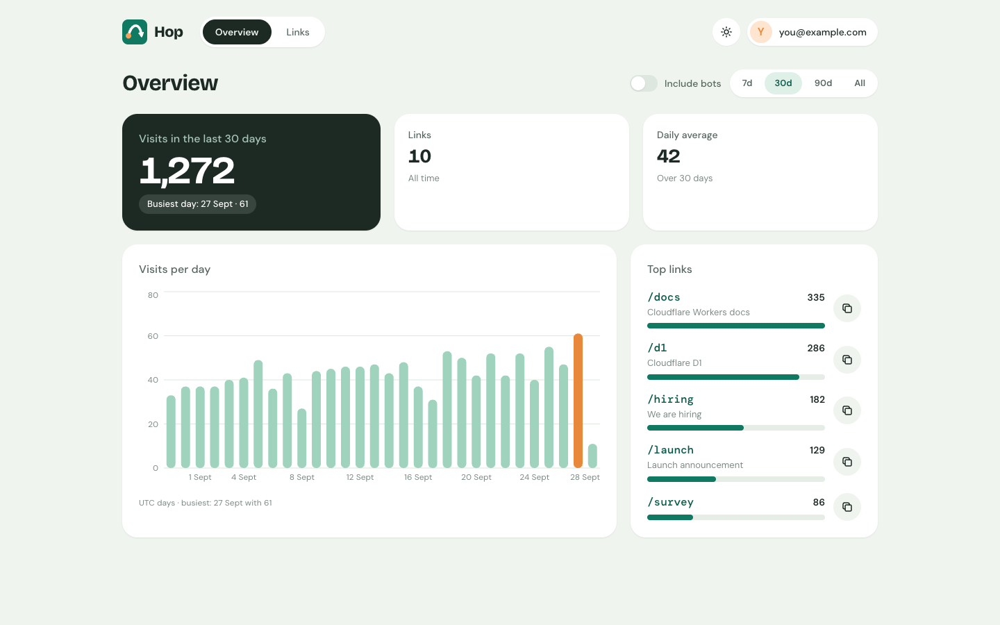
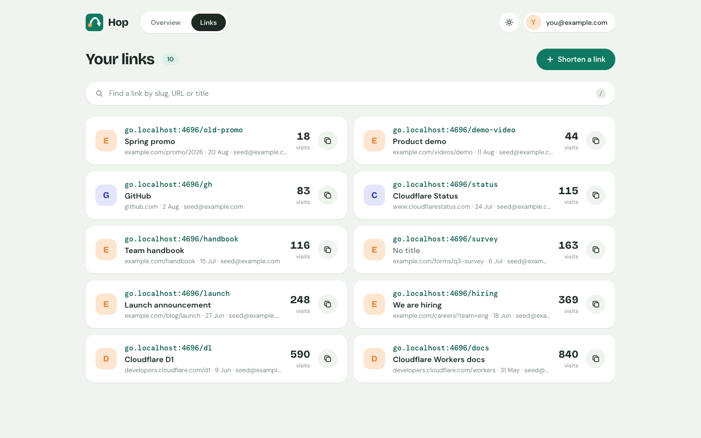
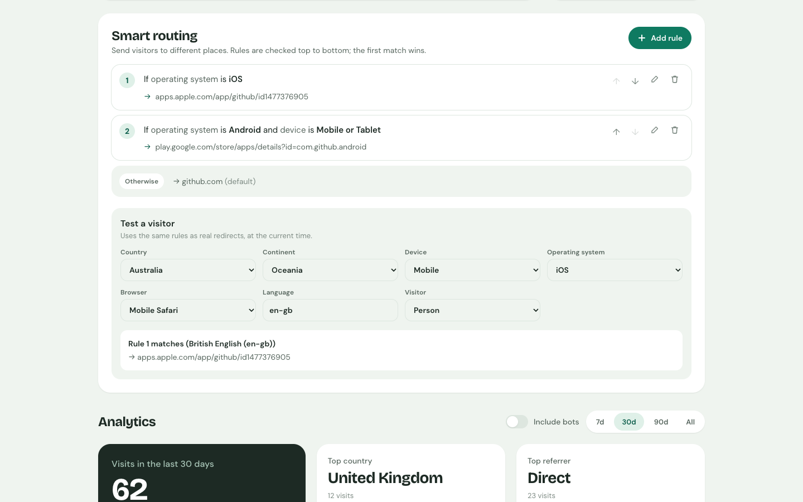
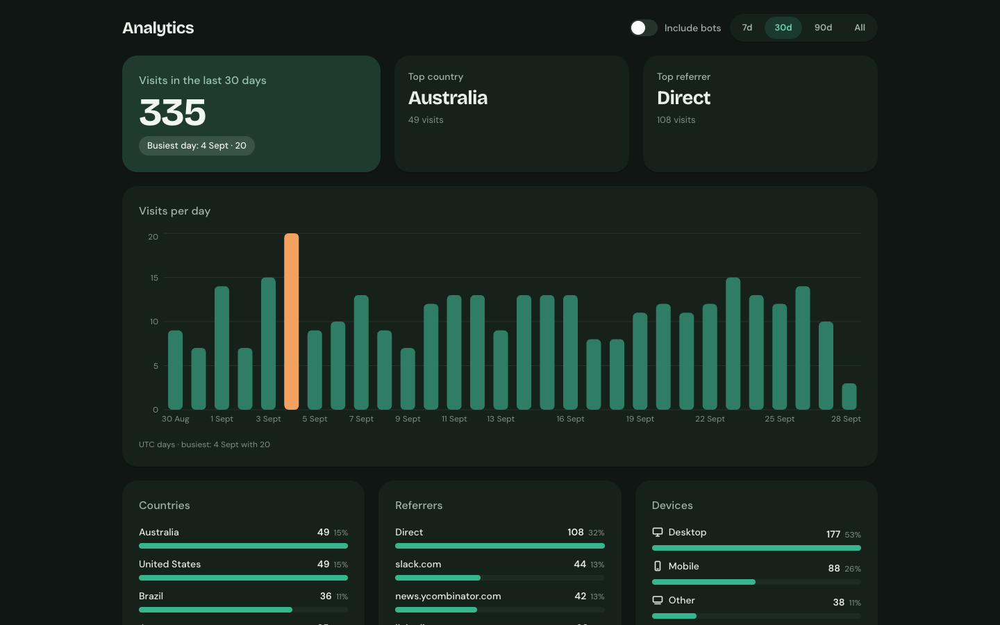
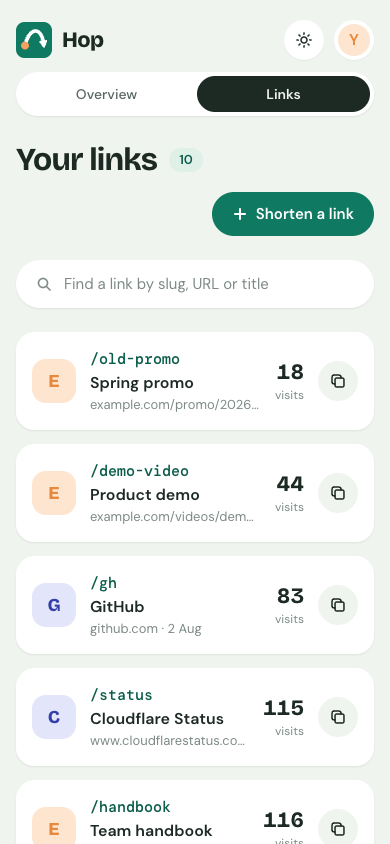

<p align="center">
  
</p>

<h1 align="center">Hop</h1>

<p align="center">
  A self-hosted URL shortener for teams, running on Cloudflare Workers.<br>
  Short links on your own domain, a dashboard with analytics and smart routing,<br>
  and sign-in handled by Cloudflare Access. Free for a small team.
</p>

<p align="center">
  <a href="LICENSE"></a>
  
</p>



## Features

- **Short links on your domain.** `go.yourcompany.com/launch` → anywhere. Custom or random
  slugs, titles fetched automatically, query strings passed through.
- **Smart routing.** Send visitors to different places by country, continent, device, browser,
  OS, language, or bot vs person. Add time windows, and split traffic for A/B tests.
- **Analytics without tracking people.** Visits per day, countries, referrers, devices, browsers
  and operating systems, with bots filtered out. Hop never stores IP addresses.
- **QR codes** for every link, downloadable as SVG or PNG.
- **A dashboard your team will actually use.** Search, copy buttons everywhere, light and dark
  mode, works on phones.
- **No login code to trust.** Cloudflare Access (Google, GitHub, or one-time email codes) guards
  the dashboard and API at Cloudflare's edge, and the Worker verifies every sign-in token too.
- **Fast redirects.** One indexed database read, then the redirect. Analytics are written after
  the response is sent.

| Links | Smart routing |
|---|---|
|  |  |

| Analytics (dark mode) | On a phone |
|---|---|
|  |  |

## How it works

```
Visitor ──▶ go.yourcompany.com/launch ──▶ Worker ──▶ D1 (one read) ──▶ 302 to the destination
                                              └──▶ records the visit in the background

Team ──▶ go.yourcompany.com/admin ──▶ Cloudflare Access (sign-in) ──▶ Worker ──▶ dashboard + API
```

Everything runs on Cloudflare: a Worker (Hono, TypeScript), a D1 (SQLite) database, the
React dashboard served as static assets, and Cloudflare Access for sign-in.

## Deploy your own

You need:
- a Cloudflare account (the free plan is enough) with your domain added as a zone
- Zero Trust enabled once, to pick a team name (free for up to 50 users)
- Node.js 22.22+, 24 or 26 (see `.nvmrc`)

```sh
git clone <this repo> hop && cd hop
npm install
npm run setup
```

`npm run setup` walks you through each step and asks before changing anything: your Cloudflare
account, the short-link domain, the database (reuse or create), and Cloudflare Access (set up
automatically with an API token, or guided through the dashboard). It then deploys and checks
that short links are public and the dashboard is behind your login.

Afterwards, deploy updates with:

```sh
npm run deploy
```

Your deployment's settings live in the git-ignored `hop.config.json`, so you can pull updates
from this repo without conflicts. See [docs/DEPLOYMENT.md](docs/DEPLOYMENT.md) for the details,
the Access options, and a manual fallback.

## Local development

```sh
npm install
cp .dev.vars.example .dev.vars   # DEV_AUTH_EMAIL: signs you in locally without Access
npm run db:migrate:local
npm run db:seed:local            # optional: 10 demo links and a few thousand visits
npm run dev                      # http://go.localhost:4696/admin
```

Short links work locally too: `http://go.localhost:4696/<slug>` redirects through your local
Worker. Browsers and macOS send any `*.localhost` name to your own machine, so there's nothing
to configure. For hot reload while working on the dashboard, also run `npm run dev:dashboard`
and open http://go.localhost:4697/admin/.

The local sign-in shortcut only works when `DEV_AUTH_EMAIL` is set **and** the request is to
`localhost`, a `*.localhost` name or `127.0.0.1`. Cloudflare only routes your real domain to the
deployed Worker, so a production request can never look local.

### Commands

| Command | What it does |
|---|---|
| `npm run dev` | Build the dashboard, then run the Worker on http://go.localhost:4696 |
| `npm run dev:dashboard` | Vite dev server with hot reload on :4697 (proxies `/api` to the Worker) |
| `npm run typecheck` | TypeScript checks for the Worker and the dashboard |
| `npm test` | Portability boundary check, then Vitest in the Workers runtime |
| `npm run db:migrate:local` | Apply migrations to the local database |
| `npm run db:seed:local` | Replace local data with demo links and visits |
| `npm run setup` | Interactive first deploy |
| `npm run deploy` | Checks, build, database migrations, deploy, live checks |
| `npm run doctor` | Check deploy readiness without changing anything (`-- --live` also checks the site) |
| `npm run db:migrate:remote` | Apply migrations to the production database |

## Cost and limits

For a small team, Hop fits in Cloudflare's free tiers: Workers Free, D1 free, and Zero Trust
free (up to 50 users). Each click is one small D1 write. If a link goes viral, the Workers Paid
plan raises the daily limits; check Cloudflare's pricing page for current numbers.

## Privacy

Hop records, per visit: time, country/region/city (from Cloudflare), the referring site's
host name, device type, browser, OS, and whether it looks like a bot. It never stores IP
addresses or full referrer URLs, sets no cookies on people who click links, and has no tracking
scripts. (Cloudflare Access sets its own sign-in cookie for dashboard users.)

## FAQ

**Why Cloudflare Access instead of built-in logins?** It gives you Google, GitHub or email-code
sign-in, and the rules for who's allowed in, without Hop storing any passwords or sessions.

**Can I run it somewhere other than Cloudflare?** Not today. The database, geo lookup and
sign-in sit behind small interfaces ([docs/ARCHITECTURE.md](docs/ARCHITECTURE.md)), so another
runtime could be added without rewriting the app.

**Is anything sent to third parties?** No. The dashboard's fonts are self-hosted, and title
fetching only requests the page you're shortening.

**What's deliberately not included?** Link expiry, tags, multiple domains, API keys and user
roles. See the non-goals in [docs/SPEC.md](docs/SPEC.md).

## Documentation

- [Spec](docs/SPEC.md): what Hop does and doesn't do
- [Architecture](docs/ARCHITECTURE.md): code layout, data model, auth, request flow
- [API](docs/API.md): the dashboard's JSON API
- [Deployment](docs/DEPLOYMENT.md): setup, deploys, checks

## Contributing

Contributions are welcome. See [CONTRIBUTING.md](CONTRIBUTING.md). To report a security issue,
follow [SECURITY.md](SECURITY.md) instead of opening a public issue.

## Licence

[MIT](LICENSE). The bundled fonts (Bricolage Grotesque, DM Sans, DM Mono) are under the SIL Open
Font License; their licence files are in `dashboard/public/fonts`. `ua-parser-js` is pinned to v1
(MIT) because v2 is AGPL.
